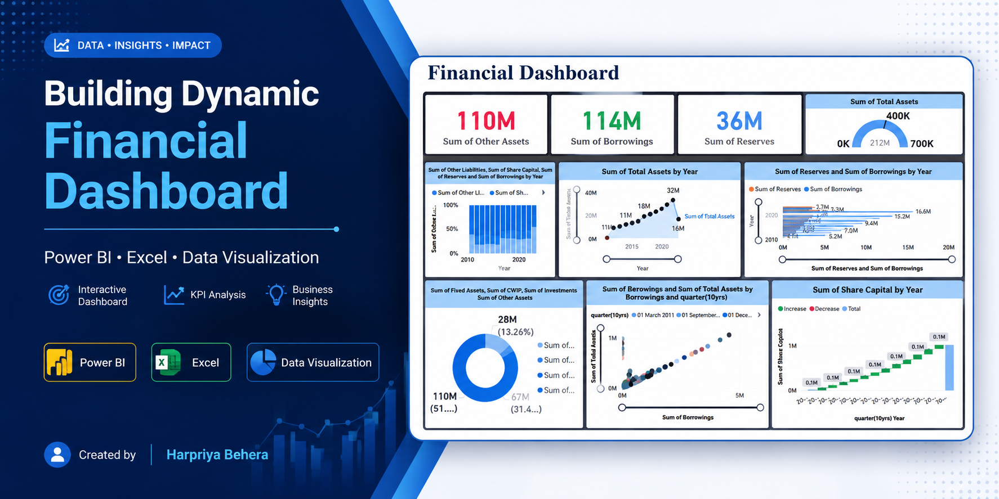

# 📊 Building Dynamic Financial Dashboard using Power BI

## 📌 Project Overview

This project demonstrates how Power BI can transform financial data into interactive dashboards for business decision-making. The dashboard provides insights into revenue, assets, liabilities, borrowings, reserves, and overall financial performance using dynamic visualizations.

---

## 🛠️ Tools Used

- Power BI
- Microsoft Excel

---

## 📈 Dashboard Features

- Revenue Analysis
- Asset Analysis
- Borrowings vs Reserves
- KPI Cards
- Gauge Chart
- Waterfall Chart
- Donut Chart
- Scatter Plot
- Interactive Filters & Slicers

---

## 💡 Skills Demonstrated

- Data Cleaning
- Data Visualization
- Financial Reporting
- KPI Development
- Dashboard Design
- Business Intelligence
- Analytical Thinking

---

## 📊 Key Insights

- Visualized financial performance using interactive dashboards.
- Compared borrowings with reserves to evaluate financial stability.
- Tracked total assets over time.
- Designed KPI cards for quick financial monitoring.
- Built business-ready dashboards for better decision-making.

---

## 📂 Repository Contents

- Project Report (PDF)
- Dashboard Screenshots
- Dataset (Excel)
- Power BI Report (.pbix)

---

## 👩‍💻 Author

**Harpriya Behera**

MBA (Finance & Business Analytics)
